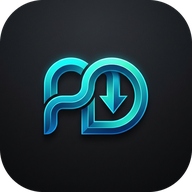

# Hi there, I'm Mahean Ahmed 👋

  

  <strong>Founder & Lead Developer @ <a href="https://pulldl.com">PullDL</a></strong> 
  <em>Building high-performance, privacy-first web utilities, streaming infrastructure, and open-source tools.</em>

  
  
  

---

### 🚀 What I'm Working On
- 🌐 **[PullDL](https://pulldl.com)** — A modern, blazing-fast universal media downloader & file converter supporting 1,290+ platforms.
- 🧩 **[PullDL Browser Extension](https://github.com/pulldl/pulldl)** — Instant 1-click media download utility for Chromium & Firefox browsers.
- ⚙️ **High-Concurrency Distributed Systems** — Scalable microservices, video demuxing pipelines, and edge proxy networks.

---

### 💻 Tech Stack & Tools
- **Languages:** TypeScript, JavaScript, Python, Go, SQL, Bash
- **Frontend:** React, Next.js, Tailwind CSS, Vite
- **Backend & Cloud:** Node.js, FastAPI, Docker, Nginx, Redis, PostgreSQL, Linux
- **DevOps:** CI/CD, Containerization, Distributed Proxy Architectures

---

  <em>Connecting technology and user privacy.</em> 
  Let's build great things together! 🚀

